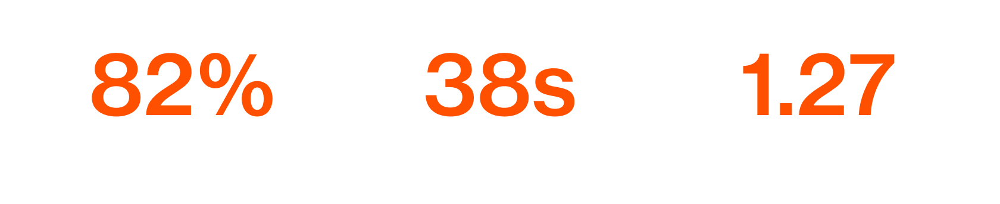
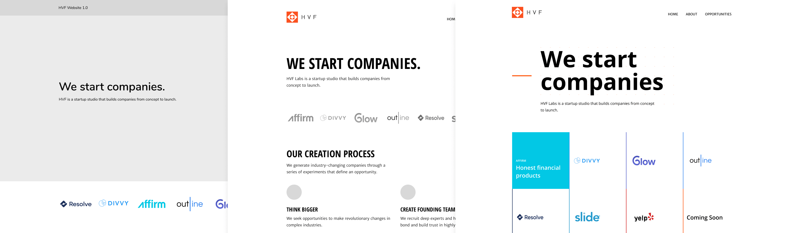
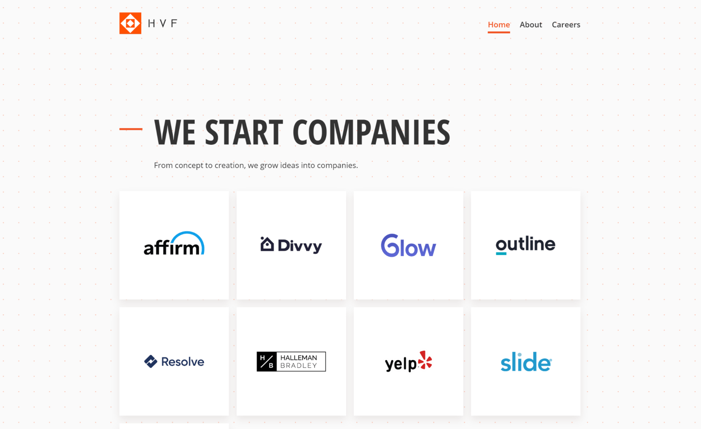
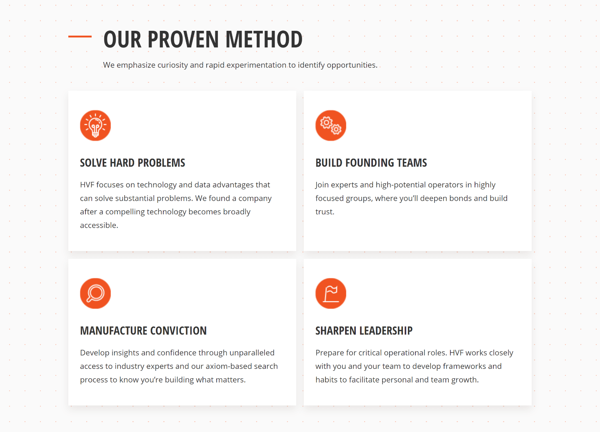
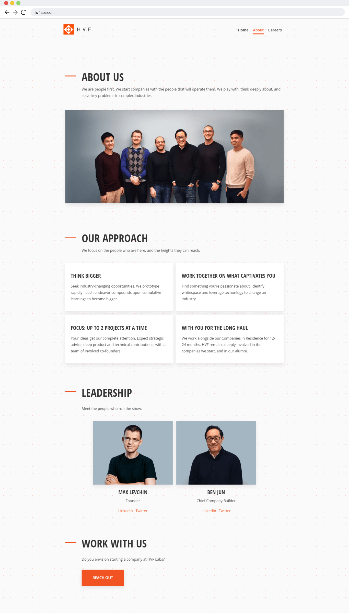
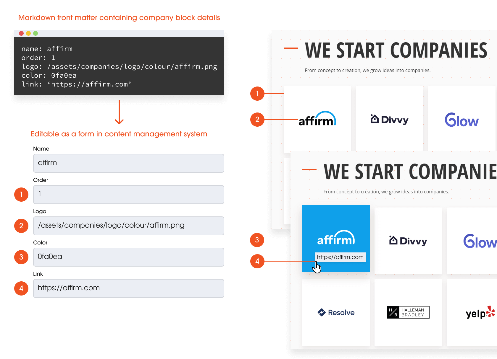
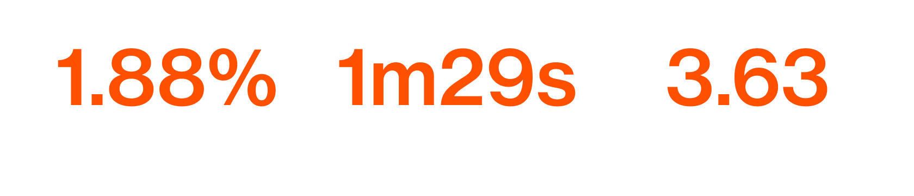

## What is HVF Labs?

HVF Labs is Max Levchin's startup studio, based in San Francisco. HVF stands for "hard, valuable, fun", which are the three criteria that any project being worked on must live up to.

Some companies that have come out of HVF are Yelp, Affirm, and Glow.

The finished website is live! You can [check it out here](https://hvflabs.com).

## My role

I was responsible for the design of the new website, as well as the implementation. I worked alongside our Chief of Staff to figure out the content and messaging we wanted on the new website.

The entire project took 3 weeks, from the initial kickoff to full implementation.

## Figuring out what to fix

We spent a day taking stock of what we currently had, and identified some areas for improvement.

### What we started with

The old website was meant to resemble a code terminal. It was very text heavy, and very orange. 

Fun fact, that orange square in the corner turns into a bouncing DVD screensaver once clicked on.

### People don't lie

The website lacked credibility, and that hurt our prospects for potential new hires and entrepreneurs. The Max Levchin name wasn't always enough.

Some testimonials from people who have visited the website:

### Let's bounce

We had Google Analytics set up, and focused on a few key metrics. 

We wanted to see the average bounce rate, session duration, and pages per session. This would tell us how many people left without doing anything on the website, how long they stayed, and how much content they read.

Of the visitors who didn't immediately leave our website, the majority went to the About page next. We assumed that these were the small subset of people who were interested enough to learn about what HVF Labs does.

## Our objectives

### Attract new talent

We need to hire the people who will become founders of the company they start at HVF Labs. The output of this objective should be a clear and compelling website that properly explains what HVF Labs does, and how it's done.

### Allow for content updates

The new website's content needed to be easily updated without knowledge of how to write HTML.

## Content-based design 

Before I went full speed ahead making potential page designs, we sat down to figure out what we wanted to say. 

What we wanted to touch on:

1. What we've created
2. What we do
3. How we do it

The old website actually did a very good job of expressing HVF Labs' methodology and conviction, so we took that copy, stripped out the superfluous content, and used this copy to put together a website structure.

### 1. What We've Created

I started my explorations by focusing on the what HVF does, which is starting companies. As I went through different iterations, I placed more emphasis on the companies that have spun out of HVF. Since HVF is not a VC firm, we wanted to highlight the fact that we've actually built all these companies, not just invested in them. 

The final design puts our portfolio of companies front and center, letting our work and history lend credibility to HVF and our mission.

This also allowed for some liveliness, where each block when hovered over will change into that company's colour.

<video class="shadow" autoplay muted loop playsinline><source src="/assets/images/projects/hvf/hover.mp4" type="video/mp4"></video>

### 2. What we do

We wanted to further drive home the point that we do more than just invest in companies - we look for difficult problems in tired industries, and find opportunities to start companies there.

The icons move on hover too. This was achieved by stacking a static PNG on top of the GIF, and on hover, the PNG is set to `display: none`. Pretty cool, eh?

<video class="shadow" autoplay muted loop playsinline><source src="/assets/images/projects/hvf/hover2.mp4" type="video/mp4"></video>

### 2.1 Who we need to do what we do

The next section focused more on the people we wanted to attract. The previous HVF website, according to many, sounded a little intimidating, and gave off the impression that we were only looking for full-stack developers and data scientists.

We kept the focus on wanting to hire EIRs and Builders, but tweaked the copy to be more inclusive. I did some illustrations to visually showcase these roles.

### The whole home page

The home page acts as the hook, where HVF Labs' proven track record and unique way of starting companies would hopefully interest potential hires. If the viewer is intrigued, they'll either head over to the About page to learn more, or click the call-to-action at the bottom to reach out.

I also designed a dot grid background, to mimic that of a dotted notebook. I thought this was a fitting way to add a little bit of texture and personality to a website of a company who's sole purpose is to iterate rapidly on new ideas.

### 3. How we do it

The about page dives deeper into how HVF Labs operates, and who would provide support and guidance.

## Implementation

After finalizing the copy and creating the required visual assets, I went onto build this thing. I used Jekyll, because it allowed for a static website to be built without a database, and could be hooked up to Netlify CMS enabling others to edit site content without knowing how to code.

Here are some of the cool things I built:

### Easy company additions

When new companies exit HVF, they get added to the hero on the home page. I wrote a loop that checks a folder containing each company's markdown file, and it automatically pulls the relevant information and adds it to a new tile.

Netlify CMS allows for every single piece of copy on the website to be edited. This enables future updates without the need to know code, because all updates can be written in plaintext. 

### Sticky navbar

I'm not well-versed in JavaScript at all, so figuring this out took much longer than I'd like to admit. Still! It's a cool way to allow users the option to navigate somewhere else no matter where they are on the current page.

<video class="shadow" autoplay muted loop playsinline><source src="/assets/images/projects/hvf/scroll.mp4" type="video/mp4"></video>

## The result

A month after launch, we checked our analytics again to see how we were doing. By all the metrics that we cared about when we undertook this project, the new website is a big success.

Less bouncy, longer sessions, and more thorough browsing sessions. Nice.

## Takeaways

As it turns out, building a compelling landing/marketing page is extremely difficult. Visual design and copy are extremely important in how a landing page can build trust with its audience, and should neer be neglected. I learned how important it is to figure out who your target demographic is early on, and focus ruthlessly on them. Along the way, I also learned a few cool tricks about keeping static websites scalable, and it's great to know I don't need to manually enter in hundreds of `

` tags when dealing with content heavy websites.

Wanna look through the real thing? You can [check it out here](https://hvflabs.com).