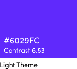

## My role

This summer (2019), I worked on the M365 Design Direction team. The Design Direction team is responsible for defining the visual language and creating the design system used by all the other M365 design teams. 

Though hired on as a UX Design Intern, I was able to focus my efforts on developing my motion design and visual design skills, thanks to support from my manager [Karina Dion](https://www.linkedin.com/in/karina-dion-2496707/), and my mentor [Sungwon Chang](https://www.linkedin.com/in/sungwon-chang-87a7a658/).

##  What did I work on?

I was tasked with improving the What's New experience in the M365 Admin Dashboard. What's New was a link in the toolbar that directed users to an article outlining new features and updates, and we wanted to educate users in a better way.

## What's the problem?

Here's what happens when a user clicks on What's New:

<video class="shadow" autoplay muted loop playsinline><source src="/assets/images/projects/microsoft/problem.mp4" type="video/mp4"></video>

We already knew at this point that the click-rate for the What's New link was low, and in general, users don't like clicking on things that take them out of the experience. 

The solution of using a carousel to highlight updates and new features is actually more disruptive than helpful, and in some cases, the carousel content is outdated.

### An interesting thought

What if What's New didn't just live in the top toolbar? What if it's actually everywhere? This way of thinking was what drove the project moving forward, and I tried to think about What's New as something contextual, rather than only applicable to one location.

## Early explorations

I asked my PM, "What are some "must-knows" for the user?" and prioritized which screens I would design based on the answer.

### New things on a dashboard

When new features are released for the admin dashboard, they'll be highlighted and the user has the option to add or dismiss the card.

### New things in the panel

When new features are released in the side panel, they're tagged "New" so that the user is aware.

### New things on a page

In pages other than the main dashboard, new features are highlighted in a big card so that users can learn about it.

## These weren't bad, but...

The problem with each of my explorations were that they only solved the What's New problem for that particular screen. There was no consistency, and this was hard to work into a system. We took a step back after this to think about how What's New can fit in everywhere.

## The hypothesis:

We believe that contextually showing what's new is better, as we can focus on new additions without being disruptive.

### Why contextual?

- We can alert users without disrupting their workflow
- We can use each alert as a teaching opportunity
- This can become a system of alerting, recognizable by colour, motion, iconography, and copy.

With our hypothesis in place, we went to tackle this problem starting from the top toolbar, designing while keeping in mind how we can apply what we make to other parts of M365.

## Make fast, test fast

I used motion and colour to create two alerts for a new card, so that we could test this in front of existing M365 customers.

### Using a sweep to draw attention

A sweeping motion moves the user's sight to what's new.

<video class="shadow" autoplay muted loop playsinline><source src="/assets/images/projects/microsoft/early4.mp4" type="video/mp4"></video>

### Using a callout 

The callout with text appears first, being the bigger object, with the intention of getting the user's attention. The badging pops out after a delay, so that users have time to shift their gaze to the area of interest before seeing it appear.

<video class="shadow" autoplay muted loop playsinline><source src="/assets/images/projects/microsoft/early5.mp4" type="video/mp4"></video>

### What did users think?

We didn't scrap the badge option. We inferred from the user testing comments that just a badge is not enough, and that an attention grabber (like the sweep) to go along with it can help draw attention, and reinforce a system.

## Further refinements

After taking in the feedback, I went ahead and made version two to get ready for testing. 

### A new colour

The previous prototypes used a teal colour, but that was a colour M365 used for data viz. I picked a new colour that would be solely used for this alerting system, and made sure it was WCAG AA complaint. 

### A combination

I took into consideration that M365 as a product lives on the web, and therefore, everything on M365 lives in a container. This would allow for a system to be applied everywhere, as long as the containers are similar in spacing and size.

With containers as a constraint in mind, I decided to limit the alert to the element we want to draw attention to. A dot badge would follow, and stay persistent, until the user interacts with the new feature. A dot is something that everyone in this day and age is accustomed to seeing as "new", so I leveraged that knowledge in my design.

<video class="shadow" autoplay muted loop playsinline><source src="/assets/images/projects/microsoft/final1.mp4" type="video/mp4"></video>

### Working elsewhere

I created another motion study, showing the application of this system on the side navigation and in a different page. This was to show that this works elsewhere, and that the colour and badging can be used to create a recognizable contextual alerting system.

<video class="shadow" autoplay muted loop playsinline><source src="/assets/images/projects/microsoft/final2.mp4" type="video/mp4"></video>

### Stress test

I put a bunch of dots on the dashboard, to show that it won't overwhelm a user. As a precaution, we also set a time of 45 days before the dots disappear, if the user doesn't dismiss them. This time period was decided based on the longest time between logins, which happened to be 6 weeks. Further tweaking, if needed, will be done based on future feedback.

### Copy  is important too!

While the sweep and badge draws attention to the new feature, the callout educates on where the new feature is. The copy should succinctly explain what the new feature is, and where to find it, which is even more important for the case where a feature lives 3 or 4 levels deep into a page.

##  How did the new design do?

Our user researchers are amazing, turning this around right before I gave my final presentation. 

(quotes)

The feedback was positive, and shows that our hypothesis is on the right track. It looks like contextual alerting is better for showing and educating users on what's new.

## What's next?

Before leaving Microsoft, I put forth some next steps for my project.

### Fabric implementation

Fabric is a design system. The plan is to implement this as a component into Fabric as a third option for alerting that's less intrusive than the current coachmark approach. This will live as a more refined, elegant way of grabbing the user's attention.

### Apply to Admin Center

This will be implemented and used anywhere on the M365 Admin Center where contextual alerting is needed.

### Think about What's New as destination

While What's New is currently an article, soon to be a contextual alerting system, for future-thinking, it could potentially be a destination, where users can go somewhere central for their information. Perhaps this could include a community aspect, or a blog, but the idea is to create a direct communication link to and from our users.

## Some other work I did

While What's New was my main project at Microsoft, I tried to get my feet wet by working on a few smaller projects with different teams and individuals. I wanted to learn as much as I could during my 12 short weeks, and what better way to do that than to try out different things?

### M365 Banner Illustrations

I created some different illustrations for the first-run experience banner on Admin Dashboard. I played with the idea of comparing setting up Admin Center to setting up an actual office, and was able to start a conversation around how we could use illustrations to better tell a story.

### Welcome Banner

Our welcome banner was in need of a refresh, and I flexed my creative muscles to come up with over 30 variations, and landed on three of my favourites. I tried to push the boundary in terms of how we could use different illustrations, sizes, and orientations to better onboard new users.

### Catastrophic Error State

I worked with a high school intern to breathe life into an error page. I learned that for even the smallest features, multiple check-offs happen to ensure design consistency. I shifted my illustration to an isometric view, because my original work didn't comply with the newly developed M365 illustration styles.

### Dark Mode

While the push for dark mode was already happening, the transition was just a simple page refresh. I had some fun making a few different explorations to offer a source of inspiration for future designers, developers, and PMs on the dark mode project.

<video class="shadow" autoplay muted loop playsinline><source src="/assets/images/projects/microsoft/dark1.mp4" type="video/mp4"></video>

<video class="shadow" autoplay muted loop playsinline><source src="/assets/images/projects/microsoft/dark2.mp4" type="video/mp4"></video>

<video class="shadow" autoplay muted loop playsinline><source src="/assets/images/projects/microsoft/dark3.mp4" type="video/mp4"></video>

## Learnings and Lessons

Did I have the best summer internship ever? Of course I did. I walked away with some valuable takeaways for my future.

### Be flexible and adaptable

Sometimes (usually always), things change. It's important to roll with the punches, and know that getting things done is a team effort. Nothing is ever a straight path, but it makes for a much more compelling story when it's not.

### Know the constraints, but don't let them constrain you

Especially at a slightly larger company like Microsoft, a ton of existing work will have been done before you get there. It's important to get familiar with what other people have made, and to leverage it into your own work, but it's also equally important to know it's totally okay to take it farther. That's how things evolve.

### Shoot for the moon

Be grandiose. Make what you want to make. Make what you think is cool. The more excited you are about your own work, the easier it is to spark conversations with others, and get them excited too. When others share your vision, it's easier to bring them along and go further with your work than if you just play it safe.

### Never become unenthusiastic

12 weeks is a really short time to get acquainted with a team, so jump in with both feet! Talk to people, work with people outside your team or organization, and be excited about your work. Positive energy is contagious, and it's apparent to everyone when you're passionate about what you're doing.

